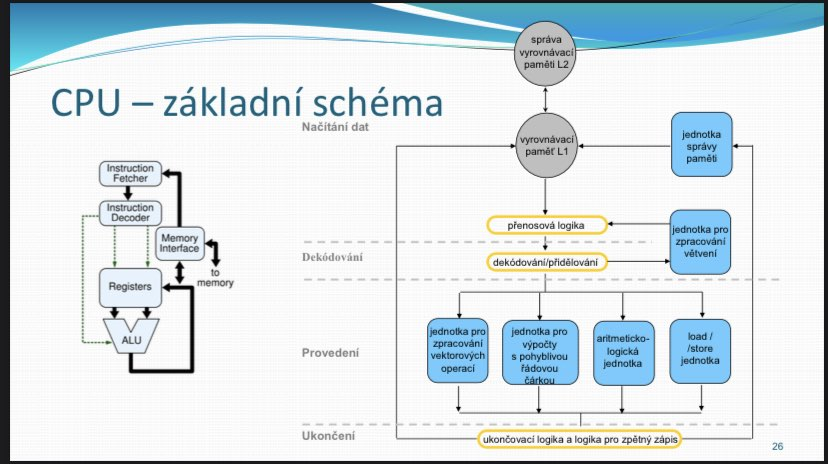

# Analýza před zkouškou z DC

Zkouška probíhá tak, že dostaneš 2 témata a máš 40 minut na to, abys napsal, co víš. Pak jdeš ven ze zkušební místnosti. Postupně si vyvolává lidi, opravuje to, co mají na papíře, a doptává se na otázky. Když je známka nerozhodná, může se zeptat i na _doplňující_ otázku mimo téma. Ústní část trvá 15–20 minut.

Ke zkoušce je třeba si vzít **psací potřeby, papíry a průkaz studenta**.

Prý je ideální popsat jednu stranu A4 na jedno téma...

Učitel si potrpí na tom, aby bylo vše popsáno dopodrobna.

Na DC lidi říkají, že z úvodní prezentace (historie atd.) se většinou nic nevyžaduje. Taky říkají, že stačí dopodrobna se naučit prezentace. Jeden student takto dokonce dostal A.

Dává také záporné body za chybné informace. Například když nakreslíš schéma špatně, může ti to pokazit výsledek (říká prý Sysel u ústní části).

Prý chodí a kontroluje, takže tahák se nedá použít. Na druhou stranu jeden student opsal vše z hodinek.

Témata se na ranních a odpoledních termínech mohou lišit.

Někdo napsal, že před ústní zkouškou na chodbě se můžeš rychle podívat do mobilu a zopakovat si dané téma.

Prý Syslovi záleží na principech fungování komponent, na obrázcích a schématech — chce vidět, že rozumíš tomu, jak to funguje. Naučená čísla, přenosové rychlosti a letopočty pro něj nejsou tak podstatné.

\+ Našel jsem [odkaz](https://www.youtube.com/playlist?list=PLna0OP34t8GDlYFsdMnu449rGmv7x9AEn) na jeho přednášky, které někdo natáčel před čtyřmi lety. Někdo psal, že jsou užitečné pro pochopení fungování komponent.

## Nejčastejší témata

| Téma                                | Podtéma                                                          | Zmíněno na DC        |
|-------------------------------------|------------------------------------------------------------------|----------------------|
| Procesor                            |                                                                  | 34                   |
|                                     | schéma                                                           | 11                   |
|                                     | skalarita                                                        | 2                    |
|                                     | superskalarita                                                   | 12                   |
|                                     | postup zpracování - PF, D1, D2, EX, WB                           | 1                    |
|                                     | k čemu je Z-buffer                                               | 1                    |
|                                     | pipeline                                                         | 5                    |
|                                     | informační kanál                                                 | 1                    |
|                                     | princip                                                          | 2                    |
|                                     | instrukční kanály                                                | 1                    |
| Polovodičové paměti                 |                                                                  | 10                   |
|                                     | jak fungují                                                      | 1                    |
|                                     | rozdělení/úrovně                                                 | 2                    |
|                                     | kde se nachází                                                   | 1                    |
|                                     | jednu vybrat a popsat podrobně                                   | 1                    |
| Paměti obecně                       |                                                                  | Součet RAM + HHD/SSD |
|                                     | Hierarchie                                                       | 1                    |
| Grafická karta                      |                                                                  | 23                   |
|                                     | schéma                                                           | 2                    |
|                                     | části                                                            | 8                    |
|                                     | pipeline (jen popis bez obrázku)                                 | 12                   |
|                                     | jak funguje 3D (pipeline)                                        | 5                    |
|                                     | dac, atd.                                                        | 1                    |
|                                     | jak se vytváří obraz                                             | 1                    |
|                                     | grafické subsystémy                                               | 3                    |
| Základní deska                      |                                                                  | 17                   |
|                                     | schéma                                                           | 6                    |
|                                     | bios/uefi                                                        | 6                    |
|                                     | co na ní patří                                                   | 1                    |
| Sběrnice                            |                                                                  | 12                   |
|                                     | jak dělíme (rozdělení/typy)                                      | 5                    |
|                                     | jednu vybrat a popsat                                            | 5                    |
|                                     | popsat fungování                                                 | 1                    |
|                                     | typy přenosu                                                     | 1                    |
|                                     | prý hlavně PCI-e                                                 | 1                    |
| Tiskárny                            |                                                                  | 4                    |
|                                     | 3 nejpoužívanější podrobně popsat (2x inkoustová, laserová, led) | 4                    |
|                                     | Barvy CMYK a RGB                                                 | 1                    |
|                                     | Bývá jako doplňující otázka                                      | 1                    |
| USB sběrnice                        |                                                                  | 10                   |
|                                     | Architektura                                                     | 1                    |
|                                     | Typy komunikace                                                  | 1                    |
|                                     | Konektory                                                        | 1                    |
|                                     | Vrstvy                                                           | 1                    |
|                                     | Typy přenosu                                                     | 1                    |
| Sekundární úložné zařízení (HDD/SSD) |                                                                 | 8                    |
|                                     | komplet jak funguje hdd/ssd                                      | 1                    |
|                                     | jednotlivé části                                                 | 1                    |
|                                     | úrovně                                                           | 1                    |
| LCD display (doplňující)            |                                                                  | 2                    |
| Optická média (doplňující)          |                                                                  | 1                    |
| Co je mikrooperace (doplňující)     |                                                                  | 1                    |
| Plug and Play (doplňující)          |                                                                  | 1                    |

## Témata seřazená podle pravděpodobnosti

1. Procesor (28,8%)
2. Grafická karta (19,5 %)
3. Paměti obecně (15,2 %)
   1. Polovodičové paměti (8,5 %)
   2. Sekundární uložiště (6,8 %)
4. Základní deska (14,4 %)
5. Sběrnice (10,2 %)
7. USB sběrnice (8,5 %)
8. Tiskárny (3,4 %)
9. LCD display - doplňující
10. Optická média - doplňující
11. Co je mikrooperace - doplňující
12. Plug and Play - doplňující

# CPU

## Základní informace

Nepostradatelná součást počítače.

Jedná se o integrovaný obvod, který je v dnešní době velmi složitý; zajišťuje výpočty systému a vykonává instrukce. Instrukce, které vykonává, se liší podle architektury procesoru.

V současnosti se nejčastěji používá instrukční sada x86_64. x86 vychází z číslování procesorů u Intelu — první IBM PC měl procesor 8086. 64bitové rozšíření zavedla společnost AMD.

Procesor do značné míry ovlivňuje výkon celého počítače.

V běžném desktopovém PC je umístěn na základní desce v patici (socket).

Existují 3 základní typy socketů:
- **Pin Grid Array (PGA)**: procesor obsahuje piny, které zapadnou do socketu základní desky.
  - Nevýhody: piny jsou náchylné k poškození (lze je snadno ohnout).
  - Výhody: piny se dají narovnat, i když je to složité.
- **Land Grid Array (LGA)**: u Intelu procesor obsahuje plošky, které doléhají na pružinky v socketu základní desky.
  - Výhody: výrobně jednodušší a procesor není náchylný k poškození.
  - Nevýhody: pružinky v socketu na základní desce se špatně opravují.
- **Ball Grid Array (BGA)**: čip je připájen přímo na desku; kontakty vypadají jako malé kuličky (balls).
  - Nevýhody: uživatelsky nevýměnný, nelze upgradovat.

## Proces výroby čipů/procesorů

Proces výroby má přes 300 kroků:
- Získání **křemíku** z písku.
- Roztavení a vytvoření **monokrystalu** (ingot).
- Ingot se nařeže na plátky (wafery), které se leští, dokud není povrch dokonale rovný.
- Fotolitografií, leptáním a osvětlováním se vytvářejí struktury tranzistorů.
- Na ně se vytvářejí vodivé cesty propojující tranzistory.
- Wafer se rozřeže na jednotlivé čipy (die).
- Čipy jsou testovány a ověřeny.
- Čipy se zabudují do pouzder a balí se.
- Hodnocení výkonu procesoru určuje maximální frekvenci a označení čipu.

Samotný procesor (včetně pouzdra a heat spreaderu) je mnohem větší než samotné die. Heat spreader slouží k efektivnímu odvádění tepla z čipu směrem k chladiči.

Při výrobě čipů se klade velký důraz na čistotu prostředí.

## Parametry ovlivňující výkon

- **Frekvence (rychlost) [Hz]:** Vyšší frekvence nemusí nutně znamenat lepší procesor. Například 4 GHz neznamená 4 miliardy sčítacích operací, protože jednotlivé operace se skládají z více kroků.
- **Počet jader (cores):** Na die může být integrovaných více jader, což umožňuje zpracování více úloh současně.
- **Šířka slova (8, 16, 32, 64) [bity]:** Dnes je standard 64 bitů. To znamená, že v jednom taktu můžeme pracovat s 64 bity; registry obvykle odpovídají této šířce.
- **Vyrovnávací paměť (cache) [Bajty]:** Cache je rychlejší než hlavní paměť, zajišťuje plynulý přísun instrukcí a dat a bývá umístěna přímo na čipu (on-die).
- **Počet instrukčních kanálů (pipeline):** Popisuje, jak instrukce procházejí procesorem a jak jsou zpracovávány.
- **Počet a typ výkonných jednotek:** Podrobněji níže.
- **Velikost adresovatelné paměti [Bajty]:** První procesor 8086 => $2^{20}$ = 1 MB. Dnešní systémy běžně podporují až $2^{40}$ (~1 TB); $2^{64}$ je pro většinu použití zatím nadbytečné.

## Mooreův zákon

Popisuje přibližné zdvojnásobení počtu tranzistorů na die přibližně každé dva roky (s každou generací čipů).

Na grafu lze vidět, že navyšování frekvence se nevyplatí, protože vzniká větší teplo, které snižuje efektivitu. To samé platí u napájení, kde pak také vzniká problém s chlazením.

Navýšení počtu jader zajišťuje efektivní zvýšení výkonu.

## Zjednodušený popis fungování

Procesor zpracovává program zapsaný ve strojovém kódu. Instrukce ve strojovém kódu jsou zapsané binárně a skládají se z operačního kódu (`opcode`), `operand 1` (informace, kde v paměti jsou data) a `operand 2` (informace, se kterým registrem se bude pracovat).

Délka/velikost instrukce v architektuře x86_64 se může lišit v rozmezí od 1 B až 11 B.

Důležité části procesoru jsou:
- **Registry:** Instrukce a data se načítají z operační paměti a přes interní sběrnice a registry vstupují do dekóderu.
- **Dekóder instrukcí:** Určí typ instrukce a její operandy a předá mikrooperace do řadiče.
- **Řadič:** Na základě instrukce řídí práci výkonných jednotek a alokaci zdrojů.
- **Výkonné jednotky:** Zde se provádějí aritmetické, logické a další operace.

## Instrukce

Vykonávají se postupně. Například sečtení dvou čísel se skládá z několika instrukcí:

- **LOAD A, R1:** Hodnota A se načte do registru R1.
- **LOAD B, R2:** Hodnota B se načte do registru R2.
- **ADD R1, R2, R3:** Sečtou se obě hodnoty a uloží se do R3.
- **STORE R3, C:** Obsah registru R3 se uloží na adresu v paměti C.
- **LOAD next instruction:** Načte se další instrukce.

## Architektura CISC vs RISC

80 % vykonávaných instrukcí je jednoduchých a 20 % komplexních.

- CISC (Complex Instruction Set Computer) — vzniklo vývojem Intelu, jak přidávali nové instrukce:
  - Jednoduchá instrukce může trvat například 4 cykly, komplexní až 8 cyklů (záleží na mikroarchitektuře).
  - Rozsáhlá instrukční sada s proměnlivou délkou a dobou vykonávání.
  - U x86 je relativně malý počet registrových zdrojů dostupných pro programátora.
- RISC (Reduced Instruction Set Computer):
  - Redukovaná sada jednoduchých instrukcí (jde o jednoduchost a konzistenci operací, ne pouze o počet instrukcí).
  - Instrukce mají stejnou délku a často kratší dobu provedení.
  - Komplexní operace se skládají z více jednoduchých instrukcí.
  - Load-store architektura.

## Instrukční kanály - pipelines

Instrukce odpovídají procesoru Pentium z roku 1993 (CISC):
- **PF (Prefetch):** Výběr instrukce (načtení z paměti podle hierarchie).
- **D1 (Decode1):** Určí délku a typ instrukce.
- **D2 (Decode2):** Určí se adresa operandů, se kterými instrukce pracuje.
- **EX (Execution):** Vlastní provedení instrukce.
- **WB (Write Back):** Zápis výsledků zpracované instrukce.

Instrukční kanál RISC procesorů:
- **Instruction fetch:** vyzvednutí instrukce.
- **Decode:** dekódování instrukce.
- **Execute:** provedení instrukce.
- **Memory Access:** přístup k paměti (čtení/zápis).
- **Commit:** zápis výsledku.

Hloubka pipeline (počet stupňů) u novějších procesorů narůstá, ale celková výkonost závisí i na taktovací frekvenci; více stupňů může znamenat vyšší frekvenci a kratší dobu mezi takty.

### Subskalární (sekvenční) zpracování

Zpracování jedné instrukce najednou — instrukce postupně procházejí všemi fázemi pipeline.

Tento režim je neefektivní a používaly ho pouze velmi staré procesory.

### Skalární (zřetězené) zpracování

Každá část CPU může v daném okamžiku zpracovávat jinou instrukci ve své fázi pipeline.

Tímto způsobem se zvýší efektivita zpracování instrukcí.

### Superskalární zpracování

Superskalární procesory dokážou najednou dekomponovat a vykonávat více instrukcí paralelně v jednom cyklu.

Moderní procesory podporují mnohem více než dva paralelní kanály, jak je znázorněno na obrázku.

Intel Pentium byl jedním z prvních komerčně úspěšných superskalárních procesorů.

### Problémy

- **Datový hazard:** Nastává, když instrukce závisí na výsledku předchozí instrukce, který ještě není dostupný.
- **Řídící hazard (branch):** Pokud procesor přednačte instrukce z větve, která se nakonec neprovede, musí je zahodit (_pipeline flush_). Moderní procesory tento problém částečně řeší predikcí větvení.
- **Strukturální hazard:** Konflikty při sdílení hardwarových zdrojů mezi různými fázemi pipeline, což může způsobit _pipeline stall_.

**Pipeline flush:** je vyprázdnění instrukčního kanálu.
**Pipeline stall (bublina):** zpoždění zpracování následující instrukce.

### Minimalizace vlivu bublin (pipeline stalls):

- **Predikce větvení (branch prediction):** používá se nejen u podmínek if/else, ale také u smyček. Moderní prediktory mohou dosahovat vysoké přesnosti (např. ~97 % u některých opakujících se vzorů).

Skok znamená, že výsledek podmínky byl _false_.
- **Superskalarita + vícenásobné načítání a dekódování.**
- **Simultaneous Multithreading (SMT):** AMD tuto technologii označuje SMT, Intel pak Hyper-Threading (HT).
- **Vykonání mimo pořadí (Out-of-Order execution):** Instrukce mohou být vykonávány v jiném pořadí, než ve kterém byly vydány, aby se lépe využily dostupné zdroje.
- **Spekulativní provádění instrukcí (Speculative execution):** Místo toho, aby procesor stál a čekal na podmínku, začne přednačítat a předvykonávat instrukce.
- **Přednačítání (Prefetching):** Například se z RAM do cache načítají data ze sousedních adres poblíž místa, odkud jsme právě četli, což může zrychlit opakovaný přístup (i když někdy se načtou i nepotřebná data).
- **Využití cache a bufferů.**
- **Non-temporal stores.**

## Základní schéma CPU (bude chtít u zkoušky)

- **Instruction fetcher:** Načte instrukci.
- **Instruction decoder:** Dekóduje instrukci.
- **Registers + ALU:** Provede se operace s hodnotami načtenými z registrů.
- **Registers:** Výslednou hodnotu uložíme do registrů.

Jednotky na obrázku se využívají podle `opcode`.

Schéma vpravo je skalární; aby bylo superskalární, musely by jednotlivé části být minimálně dvakrát.

## Výkonné jednotky

### Aritmeticko-logická jednotka (ALU):

Provádí aritmetické a logické operace primárně s celými čísly. Např. sčítání, odčítání, násobení, dělení, AND, OR, XOR, NOT.

### Floating-point jednotka (FPU):

Provádí operace s čísly s desetinou čárkou.

### Load/store

Načítá/ukládá data z/do paměti do/z registrů procesoru.

### Vektorová jednotka

Provádí operace na vektorech dat. Používá se pro velká množství dat, zpracování obrazu, simulace a AI.

## Moderní procesor

- **System on Chip (SoC):** Integrovaný obvod, který zahrnuje více částí systému do jediného čipu (integrovaná grafická karta, cache, memory controller atd.).
- **Více jader:** Vše, co jsme probrali (schémata a zpracování instrukcí, skalárnost) bylo dosud řešeno na jednom jádře.
- **L3 cache:** Sdílená pro všechna jádra.

## Schéma jednoho jádra

- **Modrá (Front-end):** Starají se o načtení a dekódování instrukcí.
- **Červená (Back-end):** Výkonná část.
- **Zelená (paměťový subsystém):** Načítá a ukládá data z paměti.

- **L1D:** Datová cache.
- **L1I:** Instrukční cache.
- **L2:** Cache pro data i instrukce.

### Front-end

**Makroinstrukce:** ze sady x86_64 CISC
**Mikroinstrukce (RISC):** Dekódery se tvoří z makroinstrukcí

Dekóder dodává dostatečné množství mikrooperací (μOPs), aby minimalizoval bubliny. O plnění fronty se stará cache pro mikrooperace nebo dekódery a načítací jednotky.

Dekódery dělíme na jednoduché (těch je více, protože jednoduchých operací je ~80 %) a komplexní (které dekódují CISC instrukce).

### Back-end

Do ReOrder bufferu vstupuje několik mikrooperací v každém taktu. Ten umí přidělovat a přejmenovávat registry.

Potom jsou mikrooperace odesílány do scheduleru, který je připojen k portům; každý port je připojen ke skupině výkonných jednotek.

Mikrooperace jsou prováděny mimo pořadí (out-of-order), aby se zvýšila efektivita, ale může nastat datový hazard.

Výsledky jsou zasílány do Reorder Bufferu i do scheduleru, aby závislé mikrooperace měly své operandy co nejdříve k dispozici.

### Paměťový subsystém

Stará se o načítání a ukládání do paměti.

Data se do `L1D` načítají spekulativně.

## Paralelismus

Probíhá v několika úrovních:
1. **Thread Level Parallelism (TLP):** Více jader/procesorů. Program se rozdělí na více vláken a běží na více jádrech současně.
2. **Instruction Level Parallelism (ILP):** Superskalarita, mikroarchitektura. Vykonávání více instrukcí současně na jednom vláknu.
3. **Data Level Paralelism (DLP):** Založeno na vektorových jednotkách, díky čemuž získáme více výsledků najednou.

## Technologie Hyper-Threading

- Současný běh více vláken je založen na využití bublin v instrukčním kanálu (pipeline stalls).
- Navýšení výkonu je proměnlivé (převážně pomáhá při mnoha malých/rychlých operacích).
- Počet výkonných jednotek je stejný, ale je potřeba zdvojnásobit některé registrů pro oddělení kontextů.

## Tepelná ochrana

Nové čipy mají ochranu, aby se procesor nepřehřál, často v podobě vkládání instrukcí `nop`. Když je chladič špatně nainstalovaný, procesor nemusí využívat plný výkon.

## Co chce slyšet u zkoušky

- [ ] Základní popis a princip procesoru
- [ ] Schéma a popis instrukčního kanálu (pipeline)
- [ ] Vysvětlení subskalárity, skalárity a superskalárity
- [ ] Schéma a popis jádra (front-end, back-end, paměťový subsystém)
- [ ] Postup zpracování instrukce
- [ ] Zmínit výkonné jednotky při schématu

# GPU

## Grafické režim prace

- **Textový:** Umožňuje zobrazovat pouze předem definované znaky (písmena, číslice, speciální znaky) a pseudograficke znaky (pro vykresolnování tabulek) - ASCII tabulka. Mohli jsme se s ním setkat v BIOSu nebo velki starých OS.
- **Grafický:** Režim, ve kterém jsou informace zobrazovány pomocí jednotlivých pixelů (V tomto režimu je i CMD/Terminal).

## Grafická karta

Není nutnou částí pro fungování počítače.

Dělíme na dedikovanou (samostatný HW) a integrovaná (grafická karta přímo v procesoru).

### Části:

- **GPU:** CPU posílá sadu instrukcí, kterou jsou zpracovány ovladačem grafické karty a vykonány procesorem karty. Oproti CPU má mnohem více jader, mnoho pipelines. Optimalizované pro vektorové/maticové výpočty. GPU zapisuje jednotlivé frames (obrazy) do frame bufferu.
- **VRAM:** Potřebnou velikost ($width [px] \times height [px] \times  colorDepth[b/px] = frameBuffer[b]$) určuje maximální možné rozlišení a počet (hloubka) barev (v dnešní době se využívá hlouba True Color $2^{24}$b) - 2D. Integrovaná GK využívá RAM. Ve 3D větší nároky na pěměť (Z-buffer, textury).
- **DAC (RAMDAC) převodník:** Bylo potřeba kdydysi pro VGA, protože bylo třeba převést dig. signál na analogový. Čím větší frekvence převodníku [MHZ] tím lépe. Každé staré výstupní rozhraní potřebuje svůj převodník.
- **BIOS:** Paměť typu ROM. Obsahuje firmware všerně definicí grafických módů a obrazových fontů. Inicializace probíhá v průběhu inicializace počítače (jak UEFI nastartuje v celém PC, tak spouští tento ROM BIOS).
- **Výstupní konektory:** HDMI, DP, DVI.
- **Sběrnice:** připojená k MB (teď nejčasteji PCI-e).
- **Napajení:** 6 / 8 pin. Sběrnice není schopná dodat dostatečný přísun W. PCI-e zvládne jen 75W.

Složením se jedná téměř o samostatný PC. Ale pozor! Sám o sobě není schopná fungovat. 

Pro využívání grafické karty v naší sestavě musíme nainstalovat driver.

## Jak pracuje 3D

- **Primitives:** Primitivní geometrické útvary (trojúhelník, čára, bod) - dají se z nich skálad složitější objekty.
- **Vertex:** Vrcholy primitires. Jsou definovány umístěním v 3D prostoru (x, y, z). Mohou obsahovat i další volitelné vlastnosti jako barvy, textury, atd.
- **Textury:** Dvourozměrné bitmapové obrázky (rastr) nebo povrchy určené k mapování primitiva. Větší nárky na VRAM.

## Logická/grafická pipeline

Pro využítí logické pipeline se využívají SW knihovny jako DirecX nebo OpenGL.

- Procesor odesílá vertexy do GK a ty vstupují do pipeline ke zpracování (Input Assembler), kde jsou vytvořeny primitives.
- S vertexy je v 3D prostoru postupně manipulováno (Vertex Shader, Geometry Shader).
- Pro zobrazení na monitoru je provedena rasterizace do 2D.
- Finální snímek je uložen ve Frame Bufferu.

### Části pipeline

- **Input Assembler (IA):** Odpovědná za načítání vertexů z paměti GPU (Vertex Buffer) a následné sestavování primitives.
- **Vertex Shader (VS):** Zpracovává všechny vertexy vytvořené IA. Pomocí VS můžeme s verty proamově manipulovat (transformovat) a vytvářet tak např. vlnění moře. Vertexy pouze posouvá (nepřidává nebo neodstraňuje) - vstupnem je jeden vertex a výstupe je opět jeden vertex.
- **Tesselation (TS):** Není povinná! Rozděluje jednoduchý geometrický tvar do menších částí, což má za následek celkové zvýšení detailu vykreslovaného objektu.
- **Geometry Shader (GS):** Není povinná! Používá se pro tvorbu srsti, vlasů, trávy. Výsledkem může být shaderu vertxů více, méně nebo také vůbec žádný (tvary mohou vznika, nebo i zanikat). Po průchodu je hotová úprava geometrického modelu.
- **Stream Output (SO):** Není povinná! Umožňuje přesměrovat hotové vertexy zpět na začátek pipeline a prováět na nich opetovné manipulace v dalších průchodech.
- **Rasterizace - Rasterizer (RA):** Převod 3D na 2D rastrovou mřížku, aby obraz mohl být zobrazen na monitoru. Z-buffer - uložiště pro informace o hloubce pixelu. Vylučování objektů z procesu rasterizace se říká Clipping.
- **Pixel Shader (PS):** Úkolem je zjistit barvu příslušného pixelu, který mu zaslal RA. Vypočet ovlivňován barvou textury, světlem, atd... Výstup je pak detailnější/kvalitnější.
- **Output Merger (OM):** Do Back Bufferu se ukládá finální frame. Double buffering = Back Buffer <=> Front Buffer (slouží k prezentaci smínku na monitoru).

## Unifikované Shadery

Sjednocují paralelní výpočty a Vertex, Geometry a Pixel shadery na stejných procesorech. Dřívější GPU měly pro každý typ zpracování vyhrazené samostatné procesory.

Používají se protože jednotlivé shadery nemusely být zatíženy rovnoměrně. Záleželo na typu grafiky.

Dnes to tedy prochází přes stejné výkonné jednotky jen se liší typ výpočtu, které povádí.

## Co chce slyšet u zkoušky

- [ ] Základní informace
- [ ] Části GK
- [ ] Pipeline 3D obrazu se schématem
- [ ] K čemu je DAC převodník

# Monitory

## CRT

- Ze tří katod jsou emitovány elektronové svazky, které dopadají na stínítko obrazovky. Na luminofory dopadá paprsek a bod se rozsvítí.
- Lidské oko při dostatečné frekvenci vnímá blikající bod jako stálé světlo.

## LCD

- Na začátku je homogenní podsvícení.
- První polarizační filtr propouští vlnění v jedné rovině (např. vertikální); druhý filtr je otočen o 90° a propouští vlnění v rovině kolmém na první.
- Mezi filtry jsou tekuté krystaly, které se otáčejí pomocí elektrod; to ovlivňuje, kolik světla následně projde druhým filtrem.
- Mezi elektrodou a druhým polarizačním filtrem je RGB filtr, který ovlivňuje, jakou barvu zobrazíme.

## Co chce slyšet u zkoušky

- [ ] Princip fungování LCD monitoru

# USB

