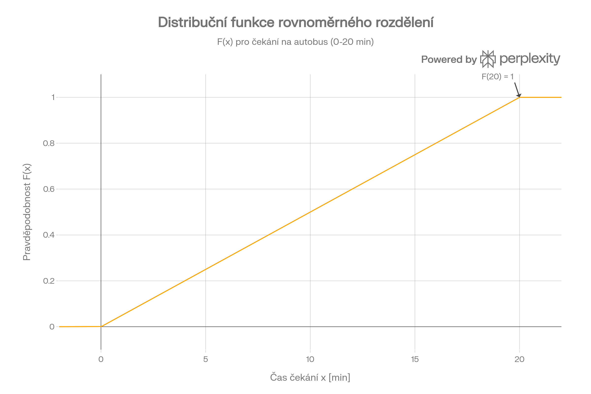
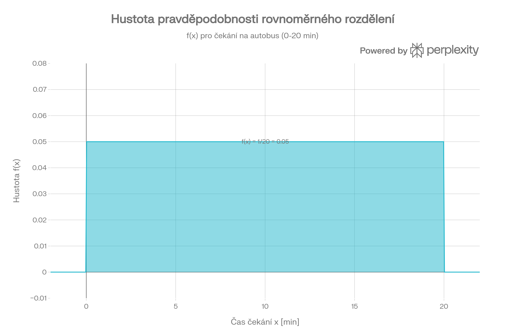
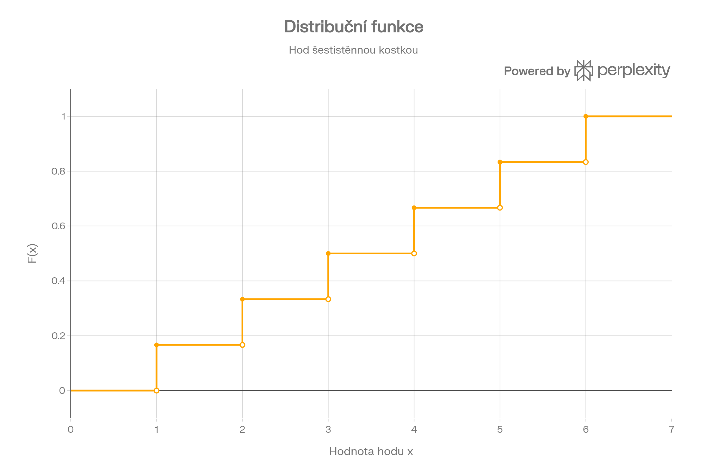
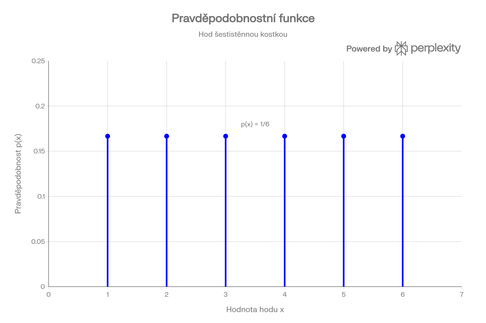
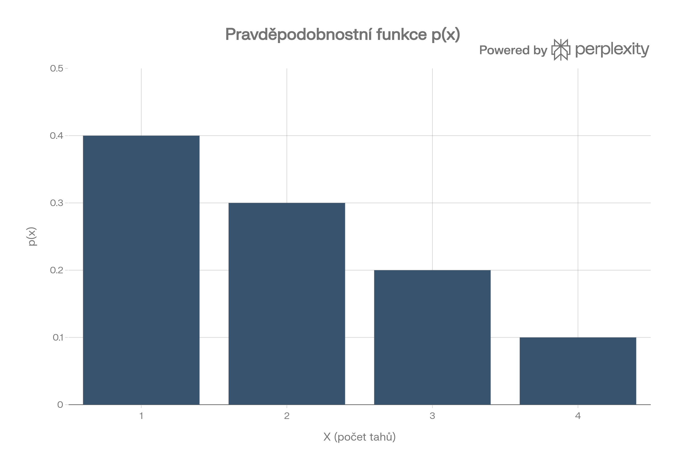
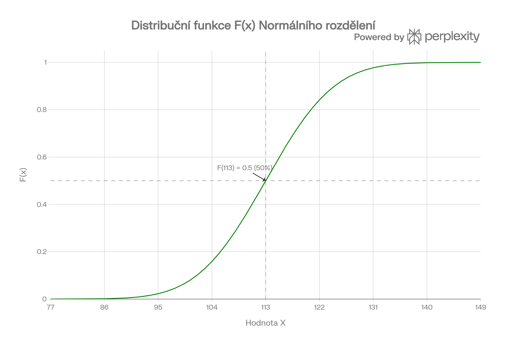
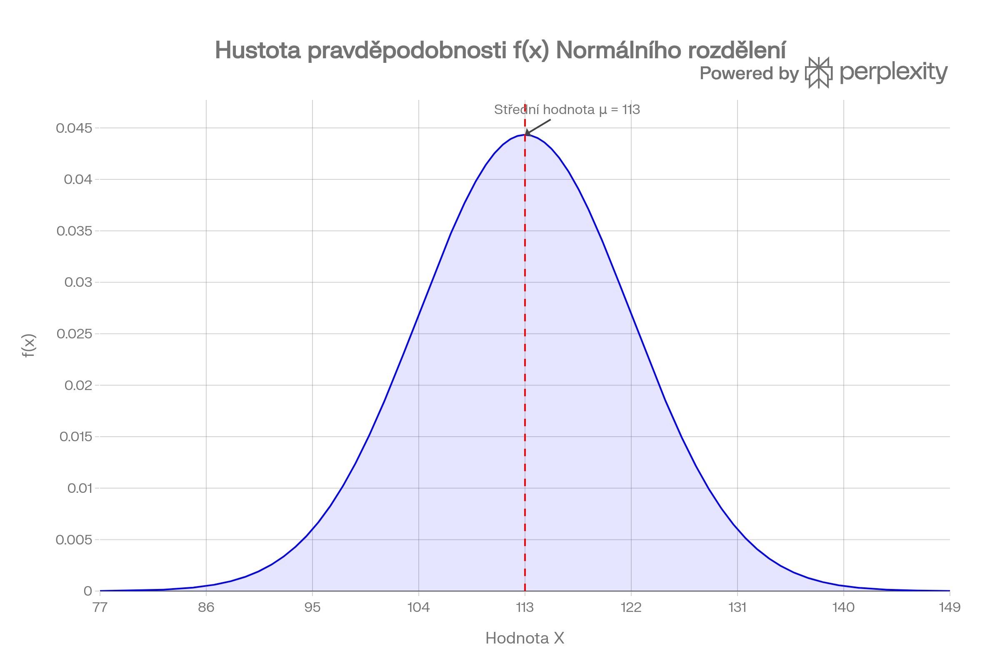

# Základní výpočty

## Převody bajtů a bitů

1 bajt (B) = 8 bitů (b)
### Příklady:

Textový soubor "data.txt" má velikost 137 bajtů. Jaká je velikost
tohoto souboru v bitech ?

$$
137 \times 8 = 1096
$$

Jak dlouho potrvá přenos 100 000 bitů při rychlosti 1200 bitů/s?

$$
s = v \times t
$$
$$
t = \frac{s}{v}
$$
$$
t = \frac{100 000}{1 200} = 83,33
$$

## Aritmetický a Vážený průměr:

### Příklad:

Určete aritmetický a vážený průměr pro předměty ve formátu P(známka, váha): P1(1, 8), P2(2, 4), P3(2, 3), P4(3, 1), P5(2, 2).

**Aritmetický průměr:**

$$
⌀ = \frac{1 + 2 + 2 + 3 + 2}{5} = 2
$$

**Vážený průměr:**

$$
⌀ = \frac{(1 \times 8) + (2 \times 4) + (2 \times 3) + (3 \times 1) + (2 \times 2)}{8 + 4 + 3 + 1 + 2} = 2
$$

## Logaritmy

$$
y = log_ax => a^y = x
$$

$$
log_ax = \frac{log_bx}{log_ba}
$$

# Kombinatorika

A zároveň = násobení

Nebo = sčítání

$n$ = celkový počet prvků, ze kterých můžeme vybírat

$k$ = počet prvků, které vybíráme

## Variace bez opakování

$$
V(k, n) = \frac{n!}{(n-k)!}
$$

Používáme, když nám **záleží na pořadí** prvků a prvky se **nemohou opakovat**.

### Příklad:

Jsou dány cifry 1, 2, 3, 4, 5. Cifry nelze opakovat. Kolik z těchto cifer můžeme sestavit dvojmístných a trojmístných čísel?

$$
V(2, 5) + V(3, 5) = 20 + 60
$$

## Variace s opakováním

$$
V'(k, n) = n^k
$$

Používáme, když nám **záleží na pořadí** prvků a prvky se **mohou opakovat**.

### Příklad:

Kolik různých hodů lze provést pomocí zadaného počtu různobarevných
(šestistěn.) kostek. a) Dvě různobarevné kostky? b) Tři různobarevné kostky? c) Pět různobarevných kostek.

**A)**
$$
n = 6
$$
$$
k = 2
$$
$$
6^2 = 36
$$

**B)**
$$
n = 6
$$
$$
k = 3
$$
$$
6^3 = 216
$$

**C)**
$$
n = 6
$$
$$
k = 3
$$
$$
6^5 =7776 
$$

## Permutace bez opakování

$$
P(n) = n!
$$

Používáme, když nám **záleží na pořadí**, prvky se **nemohou opakovat** a **$k = n$**.

### Příklady:

Jsou dány cifry 1, 2, 3, 4, 5. Cifry nelze opakovat. Kolik z těchto cifer je možno vytvořit pětimístných sudých čísel?

$$
\_\space\_\space\_\space\_\space2
$$
$$
\_\space\_\space\_\space\_\space4
$$

Na volná místa (_) můžeme dosadit $4!$ číslic (nejprve 4, potom 3, potom 2 a nakonec už jen jednu). Na posledním místě budou vždy jen číslice 2 nebo 4, abychom zajistili, že výsledné číslo bude sudé. Tzn.

$$
4! \times 2 = 24 \times 2 = 48
$$

Jsou dány cifry 1, 2, 3, 4, 5. Cifry nelze opakovat. Kolik z těchto cifer je možno vytvořit pětimístných čísel končících dvojčíslím 21?

$$
\_\space\_\space\_\space2\space1
$$

Na zbývající 3 pozice lze dosadit 3 čísla (3, 4, 5), což znamená, že můžeme dosadit $3!$ (nejprve 3 čísla, potom 2 a potom už jen poslední). Tzn.

$$
3! = 6
$$

## Permutace s opakováním

$$
P'(n_1, n_2... n_m) = \frac{n!}{n_1! \cdot n_2! \cdot ... \cdot n_m!}
$$

Používáme, když nám **záleží na pořadí**, prvky se **mohou opakovat** a **$k = n$**.

## Kombinace bez opakování

$$
\binom{n}{k} = \frac{n!}{k!(n-k)!}
$$

Používáme, když nám **nezáleží na pořadí** a prvky se **nemohou opakovat**.

### Příklad:

Na setkání po 10 letech si účastníci cinkli sklenicemi. Uskutečnilo se 45
cinknutí. Kolik účastníků se setkání zúčastnilo?

$$
celkem = 45
$$
$$
k = 2
$$
$$
n = ?
$$
$$
\frac{n!}{2!(n-2)!} = 45
$$
$$
\frac{n\times(n-1)\times(n-2)!}{2(n-2)!} = 45
$$
$$
\frac{n\times(n-1)}{2} = 45 \space/\times2
$$
$$
n^2-n-90 = 0
$$
$$
D = 1+360 = 361
$$
$$
\sqrt{D} = 19
$$
$$
n_1 = \frac{1+19}{2} = 10
$$
$$
n_2 = \frac{1-19}{2} = -9
$$

## Kombinace s opakováním

$$
C'(k, n) = \binom{n + k - 1}{k}
$$

Používáme, když nám **nezáleží na pořadí** a prvky se **mohou opakovat**.

# Pravděpodobnost

$$
P = \frac{m}{n}
$$

$m$ = chtěný počet prvků

$n$ = celkový počet prvků

Podmíněná pravděpodobnost znamená, že se celkový počet možností zúží na ty případy, kdy je daná podmínka splněna.

# Převody

## Binární soustava

`0, 1`

### Sčítání

Funguje na základě posouvání zbytku (1) do dalšího sloupce.

$$
1111\\\\\space\space\space01011\\\frac{+01111}{\space\space\space11010}
$$

### Odčítání

Funguje na základě půjčování si dvojky neboli 2 z následujícího sloupce.

$$
\space\space\space01011\\\ -01111
$$

Musím to nejprve otočit:

$$
\space\space\space01111\\\frac{-01011}{\space\space\space-100}
$$

### Násobení

Funguje stejně jako normální násobení. Nejprve spodní čísla postupně násobím každým vrchním číslem, kdy u 0 píšeme vždy 0 a u 1 řádek opisujeme. Potom všechna čísla sečteme.

### Dělení 

Funguje jako dělení polynomu polynomem. Když zjišťuješ, jestli by se jedno číslo do druhého vešlo, podle toho napíšeš 1 nebo 0 a pokračuješ dál, dokud to už nejde.

## BCD kód

Převádím každou desítkovou číslici zvlášť do binárního kódu. Tzn.

$$
78 = 0111\space1000
$$

## Římské číslice

$I = 1$

$V = 5$ (nelze použít pro odečítání)

$X = 10$

$L = 50$ (nelze použít pro odečítání)

$C = 100$

$D = 500$ (nelze použít pro odečítání)

$M = 1000$

## Osmičková soustava

`0, 1, 2, 3, 4, 5, 6, 7`

Převeď číslo 49 z desítkové do osmičkové soustavy

$$
49:8 = 6\space zb.1
$$
$$
6:8 = 0\space zb.6
$$
$$
49 = 61
$$

### Sčítání, odčítání a násobení

Funguje stejně jako v desítkové, jenom neustále uvažujeme, že maximální číslo, které můžeme zapsat, je 7. Podle toho pak určujeme, kolik jde dál. Když nám vyjde, že součet je 10, tak 1 nám jde dál a 2 (10 - 8) zapíšeme.

## Hexadecimální (šestnáctková) soustava

`0, 1, 2, 3, 4, 5, 6, 7, 8, 9, A, B, C, D, E, F`

Převeď číslo 49 z desítkové do hexadecimální soustavy

$$
49:16 = 3\space zb.1
$$
$$
3:16 = 0\space zb.3
$$
$$
49 = 31
$$

### Sčítání, odčítání a násobení

Funguje úplně stejně jako v desítkové.

## Big Endian vs Little Endian

Big: `12 34 56 78`

Little: `78 56 34 12`

## IEEE 754

Sign = 1 = záporné číslo; 0 = kladné číslo

Exponent = základem je 127; přičítáme k tomu, kolikrát jsme doleva posunuli desetinnou čárku, abychom dostali číslo 1,.....

Mantisa = zde zapíšeme zbytek za desetinou čárkou.

Dá se také zapsat jako 4 dvojice hex čísla. Jako příklady endianness jsou v tomto souboru například.

### Sčítání

[Tady je to hezky vysvětleno](https://numeral-systems.com/ieee-754-add/)

### Odčítání

[Dole je vysvětlené i odčítání](https://numeral-systems.com/ieee-754-add/)

### Násobení

[Tady je to hezky vysvětlené](https://numeral-systems.com/ieee-754-multiply/). Rozdíl oproti sčítání nebo odčítání je ten, že exponenty se sečtou a odečte se od nich bias (127), čímž získáme finální exponent. Mantisy mezi sebou roznásobíme, tak jak jsou. A desetinná čárka se po násobení dává podle součtu číslic za desetinou čárkou obou číslic.

### Dělení

[Tady je to hezky vysvětlené](https://numeral-systems.com/ieee-754-divide/). Při dělení se jen pozor na to, že exponenty se od sebe odečítají a bias se přičítá!

# Entropie

## Shannonova formule

$$
H = -\sum_{k=1}^np_k\times\log_2(p_k)
$$

$n$ = Celkový počet unikátních symbolů.

$p_k$ = pravděpodobnost výskytu konkrétního znaku.

Díky tomu zjistíme průměrné množství informace, které nese jeden znak v daném textu.

## Hartleyho formule

$$
H_{max}=\log_2(n)
$$

$n$ = Celkový počet unikátních symbolů.

Díky tomuto zjistíme maximální možné množství informace na jeden znak.

## Redundance

$$
R = 1-\frac{H}{H_{max}}
$$

Zjistíte, kolik procent textu tvoří nadbytečné informace.

## Půlení intervalů

Kdyby bychom měli uhodnout číslo v intervalu od 1

# Spojitý signál a vzorkování

## Obecná rovnice harmonického signálu

$$
y = A \times \sin(\omega t \pm \varphi)
$$

Kde:

- $A$ = Amplituda (maximální výchylka, výška vlny)
- $\omega$ = Úhlová frekvence. Vypočítá se jako $\omega = 2\pi f$.
- $f$ = Frekvence signálu v Hertzech (Hz). Po dosazení dostaneme tvar: $y = A \cdot \sin(2\pi f t \pm \varphi)$
- $t$ = Čas
- $\varphi$ = Fázový posun (počáteční posunutí vlny, udává se v radiánech)

$$
\omega = 2 \pi f
$$

## Vzorkovací frekvence

$$
f_{vz} = \frac{1}{T_{vz}} \ge 2 \cdot f_{max}
$$

Abychom mohli signál převést do digitální podoby, musíme ho navzorkovat. Pro to musí být vzorkovací frekvence alespoň 2× větší než největší frekvence, která se v signálu vyskytuje.

$T_{vz}$ je perioda vzorkování (čas mezi dvěma vzorky).

Nezapomeň na jednotky: $f_{vz}$ je v Hz a $T_{vz}$ je v s.

# Kódování

## Rovnoměrný kód

Všechny znaky mají stejný počet bitů.

## Nerovnoměrný kód

Malo používané znaky mají vetší počet bitů než ty použivané (méně používané jsou delší)

### Huffman

Bývá efektivnější.

### Fanov-Shannon

## Průměrná délka slova

$$
\bar{d} = \sum_{i=1}^{n} d_i \cdot p_i
$$

## Efektivnost

$$
\eta = \frac{H}{\bar{d}} \cdot 100 \ [\%]
$$

$d$ = počet bitů

## Pravděpodobnost chyby

$$ 
p_{ch} = \binom{m}{k} \cdot p^k \cdot (1 - p)^{m-k}
$$

$k$ = počet chyb

$m$ = počet bitů

# Bezpečnostní kódování

## Hammingová vzdálenost

Rozdíl mezi dvěma bin. čísly v 1 a 0.

## Detekční

$$
\alpha = d - 1
$$

## Korekční

$$
\beta = \frac{\alpha}{2}
$$

Zaokrouhleno dolů.

# Nesystematické kódování

$K(5, 3)$ = 5 bin. počet míst

$H$ = Kontrolní matice

$H_s$ = Z kontrolní matice $H$ získáš $H_s$ tak, že nejprve přesuneš jednotkovou matici.

$G_s$ = Transponuješ levou část $H_s$, umístíš ji napravo a do levé části přidáš jednotkovou matici.

$G$ = Generující matice

Generování slov pomocí operace XOR. Piš zakódovaná slova jako C.

Zabezpečená slova se značí $z$. Zabezpečovací binární slovo násobíme generující maticí.

Ověření přijatého slova: $s = p\times H^T$

Zakódování slova: $z = v\times G$

# Cyklické kódování

**Zatím nechápu**

# Kód běžného života

## ISBN-13 / EAN-13

1. Sčítám čísla na liché pozici.
2. Sčítám čísla na sudé pozici a násobím 3x.
3. Sečtu krok 1. a 2.
4. Výsledek ze 3. + x = číslu dělitelné 10. x = kontrolní číslo.

## EAN-8

1. Sčítám čísla na sudé pozici.
2. Sčítám čísla na liché pozici a násobím 3x.
3. Sečtu krok 1. a 2.
4. Výsledek ze 3. + x = číslu dělitelné 10. x = kontrolní číslo.

---

**Poznámky při učení:**
- Dokument 3 mi zatím dělal největší problém (projeď s Vojtou) prostě **pravděpodobnost**
- Grafy mi dělají problém